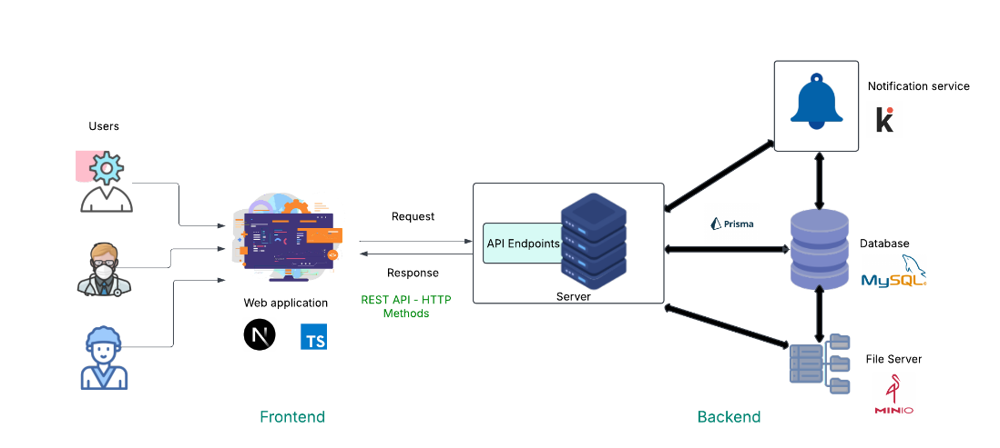
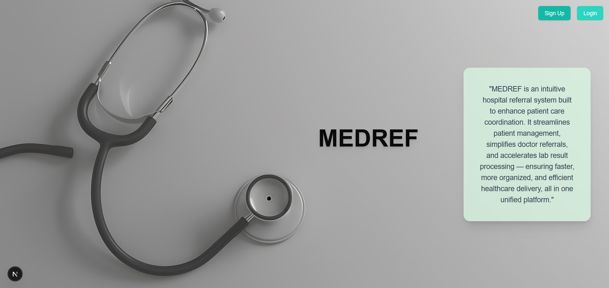

# MEDREF

# Project Overview

This project focuses on developing a web-based referral system for hospital laboratories, addressing the inefficiencies and potential inaccuracies of traditional paper-based methods still prevalent in many government hospitals. The primary goal is to create a digital platform that streamlines the exchange of physician-prescribed test requests and subsequent results between physicians and laboratories, thereby enhancing
the accuracy and efficiency of diagnostic services. The system aims to maintain a comprehensive record of patient information, including medical history and test results, ensuring seamless communication and coordination throughout the diagnostic process.The developed system will be user-friendly, catering to the needs of administrators, laboratory technicians, and physicians. It seeks to replicate the functionality of referral slips in a digital format, facilitating the transfer of samples to the appropriate laboratory and the delivery of test results to the relevant specializing physician. By implementing this system, the project aims to address the challenges associated with time wastage and the
lack of consideration for a patient’s collective medical history in traditional methods.



User Interfaces




👉 [Download Report (PDF)](./app/assets/Final_Report.pdf)

## Getting Started

First, run the development server:

```bash
npm run dev
# or
yarn dev
# or
pnpm dev
# or
bun dev
```

Open [http://localhost:3000](http://localhost:3000) with your browser to see the result.
